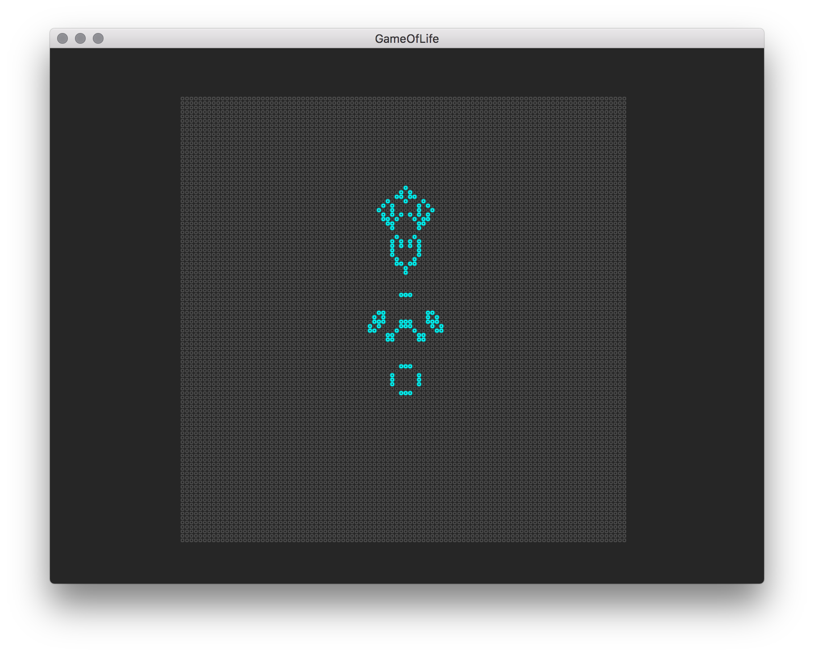

# Game of Life

It's so much fun, every software engineer should create a _Game of Life_ once. This one uses Apple's SpriteKit as a frontend, the logic is encapsuled in a Swift Package, `GameOfLifeCore`.



# Install

```bash
$ cd GameOfLifeCore
$ swift package generate-xcodeproj
generated: ./GameOfLifeCore.xcodeproj
$ open ../GameOfLife.xcworkspace/
```

The initial seed can be adjusted in `setupGameOfLife()` of `GameScene.swift`. I've commented out some gliders and spaceships.

# Test

The `GameOfLifeCore` package is written TDD style, with a code coverage of 100% 🎉 run the tests within the `GameOfLifeCore` directory.

```
$ swift test
```

 I think a XCUITest on the frontend will be overkill...will it? I'll think about it 😅

# Rules

As described on [Wikipedia](https://en.wikipedia.org/wiki/Conway's_Game_of_Life)

- Any populated cell with fewer than 2 live neighbours becomes unpopulated because of underpopulation
- Any populated cell with more than 3 populated neighbours becomes unpopulated because of overpopulation
- Any populated cell with 2 or 3 live neighbours stays populated
- Any unpopulated cell with exactly 3 populated neighbors becomes populated
